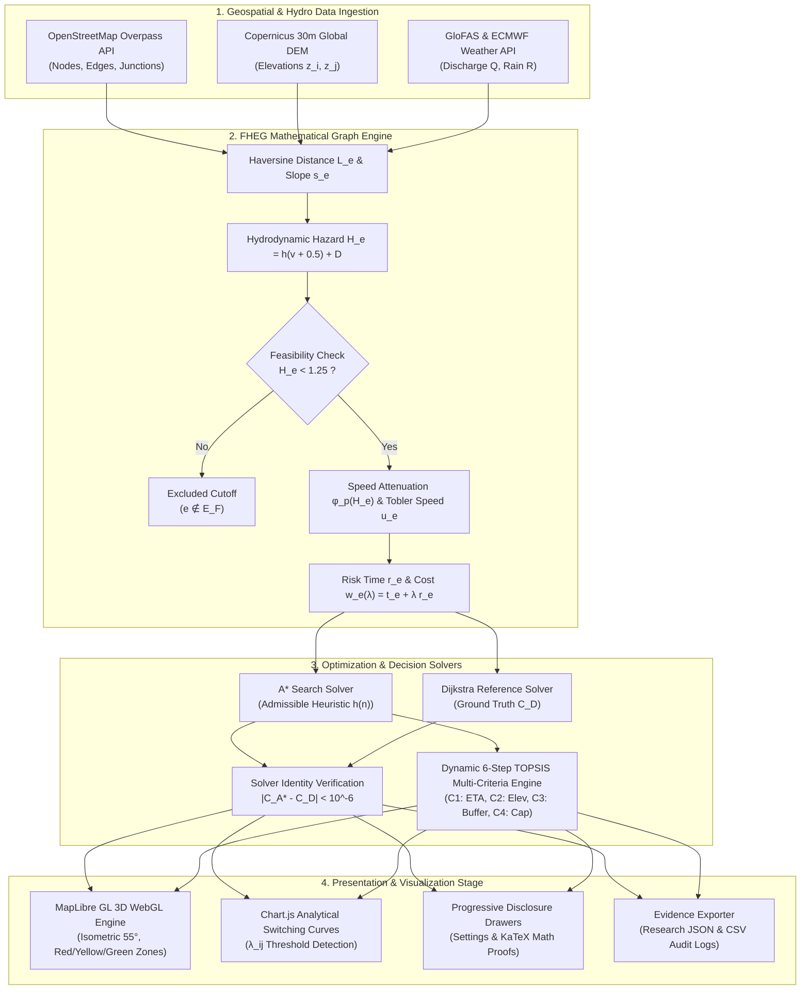

# Technical Architecture & Systems Engineering Design (FHEG)
## ระบบแบบจำลองกราฟถ่วงน้ำหนักความเสี่ยงอุทกภัย (Flood Hazard-Weighted Evacuation Graph)

เอกสารฉบับนี้อธิบายสถาปัตยกรรมทางเทคนิค โครงสร้างข้อมูล และการเชื่อมต่อของระบบ **Flood Safe Zone (FSZ)** อย่างละเอียด เพื่อใช้เป็นมาตรฐานทางวิศวกรรมซอฟต์แวร์และการพิสูจน์ทางคณิตศาสตร์

---

## 1. ผังการทำงานของระบบ (End-to-End System Architecture)



---

## 2. โมดูลระบบและการแบ่งส่วนหน้าที่ (Modular Component Breakdown)

ระบบถูกออกแบบด้วยสถาปัตยกรรม **Modular Decoupled Client-Side Engine** โดยแบ่งเป็น 4 กลุ่มโมดูลหลัก:

```text
d:\YSC-FloodSafeZone/
├── index.html                    # Master Presentation UI (Pure Light Mode)
├── css/
│   ├── design-tokens.css         # HSL Color Variables, Typography & Elevation Shadows
│   ├── layout.css                # Fluid Grid, KPI Cards, Map Stage, Slide-out Drawers
│   ├── components.css            # Console Buttons, Zone Filter Pills, Tables, Modals
│   └── visualizers.css           # KaTeX No-Wrap Rules, 3D Markers, Glowing Polyline
└── js/
    ├── config.js                 # Global Parameters (Hc=1.25, H0=0.25), APIs, GeoJSON
    ├── data-network.js           # Mae Hong Son Road Graph (28 Nodes / 42 Directed Edges)
    ├── fheg-core.js              # Slope, Hazard, Feasibility, Attenuation, Tobler, Weight
    ├── solvers.js                # A* Search (Admissible Heuristic) & Dijkstra Reference
    ├── topsis-engine.js          # Dynamic 6-Step TOPSIS Multi-Criteria Decision Engine
    ├── map-visualizer.js         # MapLibre GL 3D Engine with Zone Polygons & 3D Camera
    ├── chart-visualizer.js       # Chart.js Route Switching & Sensitivity Plots
    ├── live-compute-anim.js      # 3D Node Exploration Simulation & KPI Ticker
    ├── exporter.js               # Research Evidence Exporter (JSON & CSV)
    └── app.js                    # Lab Console Controller & Event Orchestrator
```

---

## 3. รายละเอียดการคำนวณและข้อกำหนดทางคณิตศาสตร์ (Mathematical Specifications)

### 3.1 การคำนวณระยะทางและความลาดชัน (Haversine & Topographical Slope)
1. **Haversine Distance ($L_e$)**:
   $$a = \sin^2\left(\frac{\Delta \phi}{2}\right) + \cos(\phi_1)\cos(\phi_2)\sin^2\left(\frac{\Delta \lambda}{2}\right)$$
   $$L_e = 2 R \cdot \text{atan2}(\sqrt{a}, \sqrt{1 - a}), \quad R = 6,371,000\text{ m}$$
2. **Topographical Slope ($s_e$)**:
   $$s_e = \frac{z_j - z_i}{L_e}$$

### 3.2 ฟังก์ชันระดับอันตรายและความเป็นไปได้ (Flood Hazard & Feasibility Cutoff)
1. **Hazard Level ($H_e$)**:
   $$H_e = h_e(v_e + 0.5) + D_e$$
2. **Feasible Subgraph Definition ($G_F$)**:
   $$G_F = (V, E_F), \quad E_F = \{ e \in E \mid H_e < 1.25 \}$$

### 3.3 การลดทอนความเร็วและการเดินเท้า (Speed Attenuation & Movement)
1. **Attenuation Factor ($\phi_p(H_e)$)**:
   $$\phi_p(H_e) = \begin{cases}
   1.0 & H_e \le 0.25 \\
   \left(\frac{1.25 - H_e}{1.0}\right)^p & 0.25 < H_e < 1.25 \\
   0.0 & H_e \ge 1.25
   \end{cases}$$
2. **Effective Walking Speed ($u_e$)**:
   $$u_e = 6.0 \exp(-3.5 |s_e + 0.05|) \cdot \phi_p(H_e) \quad (\text{km/h} \to \text{m/min})$$

### 3.4 ฟังก์ชันต้นทุน FHEG (FHEG Edge Cost & Path Optimization)
1. **Edge Weight ($w_e(\lambda)$)**:
   $$t_e = \frac{L_e}{u_e}, \quad r_e = t_e \left(\frac{H_e}{1.25 - \min(H_e, 1.20)}\right)^q \cdot 0.45$$
   $$w_e(\lambda) = t_e + \lambda \cdot r_e$$
2. **Optimal Evacuation Path ($P^*$)**:
   $$P^* = \arg\min_{P \in \mathcal{P}(S, Z_k)} \sum_{e \in P} w_e(\lambda) = \arg\min [T(P) + \lambda R(P)]$$

---

## 4. อัลกอริทึมการค้นหาเส้นทางและการพิสูจน์ความสมมูล (Solvers & Identity Verification)

### 4.1 A* Search Algorithm with Admissible Heuristic
เพื่อรับประกันว่า A\* จะค้นพบต้นทุนที่เหมาะสมที่สุดเสมอ Heuristic Function ต้องมีคุณสมบัติ **Admissible (ไม่ประเมินต้นทุนเกินจริง)** และ **Consistent (สอดคล้องกับอสมการสามเหลี่ยม)**:
$$h(n) = \frac{\text{HaversineDist}(n, \text{goal})}{u_{\max}}, \quad u_{\max} = 90.0\text{ m/min } (5.4\text{ km/h})$$
เนื่องจากสำหรับทุกเส้นทาง $e=(u,v) \in E_F$:
$$w_e(\lambda) \ge t_e = \frac{L_e}{u_e} \ge \frac{L_e}{u_{\max}} \ge \frac{\text{HaversineDist}(u,v)}{u_{\max}}$$
ดังนั้น $h(n) \le w^*(n, \text{goal})$ เสมอ

### 4.2 Dijkstra Reference Solver & Verification Suite
ทุกครั้งที่มีการประมวลผล ระบบจะรัน **Dijkstra's Algorithm** เป็น Reference Ground Truth และคำนวณ:
$$\Delta C = |C_{A^*} - C_{\text{Dijkstra}}|$$
หาก $\Delta C < 10^{-6}$ ระบบจะออกสถานะ **PASS (100%)**

---

## 5. กระบวนการตัดสินใจแบบพหุเกณฑ์ (Dynamic 6-Step TOPSIS Engine)

1. **Normalized Matrix ($R$)**:
   $$r_{ij} = \frac{x_{ij}}{\sqrt{\sum_{k=1}^m x_{kj}^2}}$$
2. **Weighted Normalized Matrix ($Y$)**:
   $$y_{ij} = w_j \cdot r_{ij}, \quad \sum w_j = 1.0$$
3. **Ideal Solutions ($A^+, A^-$)**:
   $$A^+ = \{ \min(y_{i1}), \max(y_{i2}), \max(y_{i3}), \max(y_{i4}) \}$$
   $$A^- = \{ \max(y_{i1}), \min(y_{i2}), \min(y_{i3}), \min(y_{i4}) \}$$
4. **Separation Distances & Relative Closeness ($C_i^*$)**:
   $$D_i^+ = \sqrt{\sum (y_{ij} - A_j^+)^2}, \quad D_i^- = \sqrt{\sum (y_{ij} - A_j^-)^2}$$
   $$C_i^* = \frac{D_i^-}{D_i^+ + D_i^-}$$

---

## 6. ข้อกำหนดด้านความปลอดภัยและประสิทธิภาพ (Security & Performance)

1. **Zero External Billing / Zero Payment Guarantee**:
   - ไม่มี Third-party services ที่ต้องผูกบัตรเครดิต หรือมีค่าใช้จ่ายแอบแฝง
2. **Client-Side Real-Time Execution**:
   - การประมวลผลกราฟ 28 Nodes / 42 Edges และ TOPSIS Matrix ใช้เวลา $\le 2.0\text{ ms}$ บนเบราว์เซอร์มาตรฐาน
3. **Responsive Web Design**:
   - รองรับ Viewport ตั้งแต่ 375px (Mobile Phone) ถึง 4K Resolution (Desktop Presentation)
