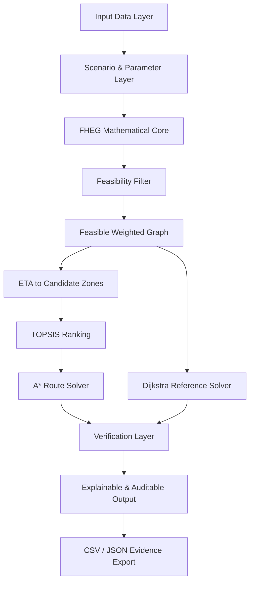

# Flood Safe Zone — Project Blueprint

> **Project:** Flood Safe Zone (FSZ)  
> **Mathematical Model:** Flood Hazard-Weighted Evacuation Graph Model (FHEG Model)  
> **Project Type:** Applied Mathematics Research + Webapp Proof of Concept  
> **Academic Year:** 2569  
> **Blueprint Status:** Canonical project blueprint  
> **Principle:** **Mathematics first. Webapp as proof.**

---

## 0. Purpose of This Blueprint

ไฟล์นี้เป็น **เอกสารแกนกลาง (single source of truth)** ของโครงงาน Flood Safe Zone เพื่อใช้ควบคุมทิศทางการพัฒนาให้เอกสารวิจัย, สมการ, การทดลอง, Webapp, ภาพประกอบ และการนำเสนอ สอดคล้องกันทั้งหมด

เอกสารนี้ควรใช้เป็นต้นทางสำหรับ

- Proposal
- รายงานโครงงาน 5 บท
- Equation Master
- `README.md`
- Webapp / `index.html`
- ชุดข้อมูลทดลอง
- ชุดทดสอบ Validation
- Poster / Slide / Pitch
- คำตอบสำหรับกรรมการ
- การพัฒนาระบบเวอร์ชันถัดไป

> หากเอกสารหรือโค้ดส่วนอื่นขัดกับ Blueprint นี้ ให้ตรวจสอบก่อนว่า Blueprint หรือ Equation Master เวอร์ชันใดเป็นเวอร์ชันล่าสุด แล้วแก้ให้ทุกส่วนกลับมาสอดคล้องกัน

---

# 1. Project Identity

## 1.1 ชื่อโครงงานภาษาไทย

**การพัฒนาและวิเคราะห์แบบจำลองกราฟถ่วงน้ำหนักตามอันตรายจากน้ำท่วม สำหรับการเลือกจุดปลอดภัยและหาเส้นทางอพยพที่เหมาะสม**

## 1.2 ชื่อภาษาอังกฤษ

**Development and Analysis of a Flood-Hazard-Weighted Graph Model for Safe-Zone Selection and Optimal Evacuation Routing**

## 1.3 ชื่อแบบจำลอง

**Flood Hazard-Weighted Evacuation Graph Model (FHEG Model)**

## 1.4 ชื่อ Webapp

**Flood Safe Zone (FSZ)**

## 1.5 Positioning

โครงงานนี้ต้องถูกนำเสนอเป็น

> **โครงงานคณิตศาสตร์ประยุกต์ที่พัฒนาและวิเคราะห์แบบจำลองบนกราฟ เพื่อศึกษาการตัดสินใจเลือกจุดอพยพและเส้นทางภายใต้ความเสี่ยงจากน้ำท่วม**

ไม่ใช่

- โครงงานสร้างเว็บ
- แอปนำทางทั่วไป
- ระบบ IoT
- ระบบเตือนภัยน้ำท่วม real-time
- ระบบรับรองความปลอดภัย
- แอปที่อ้างว่าสามารถเลือก “เส้นทางที่ปลอดภัยที่สุดจริง”

Webapp เป็นเพียง **Proof of Model / Mathematical Model Explorer**

---

# 2. One-Sentence Core Idea

> แทนเครือข่ายถนนด้วยกราฟกำกับ แล้วเปลี่ยนความลึกน้ำ ความเร็วกระแสน้ำ ความลาดชัน และเศษวัสดุให้เป็นข้อจำกัดและต้นทุนทางคณิตศาสตร์ เพื่อจัดอันดับจุดอพยพและหาเส้นทางที่มีต้นทุนแบบจำลองต่ำที่สุดภายใต้พารามิเตอร์ที่กำหนด

---

# 3. Problem Statement

ระบบนำทางทั่วไปมักเลือกเส้นทางจากระยะทางหรือเวลา แต่ในสถานการณ์น้ำท่วม

- ถนนที่สั้นกว่าอาจมีน้ำลึกกว่า
- น้ำตื้นอาจยังอันตรายหากกระแสน้ำเร็ว
- ถนนบางช่วงอาจควรถูกตัดออกจากตัวเลือกโดยสิ้นเชิง
- เส้นทางที่เร็วที่สุดอาจไม่ใช่เส้นทางที่เหมาะสมภายใต้ความเสี่ยง
- จุดอพยพที่เหมาะสมไม่ได้ขึ้นกับระยะทางเพียงเกณฑ์เดียว

ดังนั้นปัญหาหลักไม่ใช่เพียง

\[
\min \text{distance}
\]

แต่คือการสร้าง **ฟังก์ชันต้นทุนและข้อจำกัดที่ตรวจสอบได้ทางคณิตศาสตร์**

---

# 4. Research Contribution

Contribution หลักของโครงงานต้องอยู่ที่ **FHEG Mathematical Core**

ประกอบด้วย

1. การนิยามถนนเป็น Directed Graph
2. การสร้าง Flood Hazard Function
3. การสร้าง Feasibility Constraint
4. การสร้าง Hazard Attenuation Function
5. การคำนวณ movement / travel time บนแต่ละ edge
6. การนิยาม risk-equivalent term
7. การสร้าง generalized edge weight
8. การวิเคราะห์ trade-off ด้วยพารามิเตอร์ \(\lambda\)
9. การจัดอันดับจุดอพยพด้วย TOPSIS
10. การหา optimal path ด้วย A*
11. การตรวจสอบผล A* ด้วย Dijkstra
12. การพิสูจน์/ตรวจสอบสมบัติทางคณิตศาสตร์ของแบบจำลอง
13. การทำ sensitivity analysis
14. การใช้ Webapp เป็นเครื่องมือสาธิตและตรวจสอบย้อนกลับ

---

# 5. Research Questions

คำถามวิจัยหลักควรครอบคลุมอย่างน้อย

1. จะนิยาม FHEG ให้แปลงข้อมูลน้ำท่วมและภูมิประเทศเป็นข้อจำกัดและน้ำหนักของกราฟได้อย่างไร
2. Flood Hazard Function มีพฤติกรรมสมเหตุสมผลต่อ \(h\), \(v\), และ \(D\) หรือไม่
3. Hazard Attenuation Function มีความต่อเนื่องและไม่เพิ่มตามระดับอันตรายหรือไม่
4. การเปลี่ยน \(\lambda\) ทำให้เกิด trade-off และ route switching อย่างไร
5. TOPSIS สามารถจัดอันดับ candidate safe zones จากหลายเกณฑ์ได้อย่างไร และลำดับไวต่อน้ำหนักเกณฑ์เพียงใด
6. A* และ Dijkstra ให้ optimal modeled cost เท่ากันภายใต้เงื่อนไขเดียวกันหรือไม่
7. Flood Safe Zone สามารถคำนวณตรงกับ reference calculation และแสดงเหตุผลของผลลัพธ์ย้อนหลังได้หรือไม่

---

# 6. Research Objectives

1. สร้างแบบจำลองกราฟ FHEG พร้อมนิยามตัวแปร สมการ และข้อจำกัดอย่างเป็นระบบ
2. วิเคราะห์สมบัติสำคัญ เช่น monotonicity, continuity, non-negativity, existence, admissibility และ consistency
3. ศึกษา trade-off ระหว่างเวลาและความเสี่ยง
4. วิเคราะห์ route switching เมื่อ \(\lambda\) เปลี่ยน
5. สร้างกระบวนการ TOPSIS สำหรับ candidate safe zones
6. ทดลองแบบจำลองบน controlled graph และ synthetic graph
7. ตรวจสอบ A* เทียบกับ Dijkstra
8. พัฒนา Flood Safe Zone เป็นเครื่องมือสนับสนุนการทดลองและการสื่อสารแบบจำลอง

---

# 7. Scope

## 7.1 Mathematical Scope

ศึกษา

- Graph Theory
- Weighted Directed Graph
- Mathematical Modelling
- Constrained Optimization
- Multi-Criteria Decision Making
- TOPSIS
- A*
- Dijkstra
- Sensitivity Analysis
- Numerical Verification

## 7.2 Demonstration Area

กรณีศึกษาเชิงสาธิต:

**เขตเมืองแม่ฮ่องสอนและโครงข่ายถนนที่เชื่อมต่อภายในขอบเขตศึกษาที่กำหนด**

การใช้พื้นที่นี้เป็น **demonstration case** ไม่ได้หมายความว่าแบบจำลองได้รับการรับรองภาคสนามแล้ว

## 7.3 Data Scope

ระยะ Proof of Concept ใช้

- real/simplified road geometry หรือ graph ที่เตรียมไว้
- elevation data ตามที่หาได้
- synthetic flood scenarios
- synthetic / controlled depth
- synthetic / controlled flow velocity
- debris factor ตาม scenario

ไม่จำเป็นต้องมีระบบ real-time เพื่อให้โครงงานบรรลุเป้าหมายทางคณิตศาสตร์

---

# 8. Graph Definition

กำหนดเครือข่ายเป็นกราฟกำกับ

\[
G=(V,E)
\]

โดย

- \(V\) = เซตของ nodes เช่น intersection, start point, candidate zone
- \(E\) = เซตของ directed road edges

สำหรับ edge \(e=(i,j)\) ให้เก็บอย่างน้อย

| Symbol | Meaning |
|---|---|
| \(L_e\) | ความยาว edge |
| \(z_i\) | elevation ของ node ต้นทาง |
| \(z_j\) | elevation ของ node ปลายทาง |
| \(h_e\) | water depth |
| \(v_e\) | flow velocity |
| \(D_e\) | debris / obstruction factor |
| \(s_e\) | slope |
| \(H_e\) | flood hazard |
| \(\phi_e\) | attenuation |
| \(u_e\) | effective walking speed |
| \(t_e\) | travel time |
| \(r_e\) | risk-equivalent time |
| \(w_e\) | FHEG edge weight |

---

# 9. Mathematical Core

## 9.1 Slope

\[
s_e=\frac{z_j-z_i}{L_e}
\]

---

## 9.2 Flood Hazard Function

\[
H_e=h_e(v_e+0.5)+D_e
\]

โดย

- \(h_e\) = water depth
- \(v_e\) = flow velocity
- \(D_e\) = debris factor

โมเดลนี้ทำให้กรณี **น้ำตื้นแต่ไหลเร็ว** สามารถมี hazard สูงได้ ซึ่งเป็นหนึ่งในประเด็นสำคัญที่ต้องใช้ controlled experiment สาธิต

### Monotonicity

เมื่อกำหนดตัวแปรอื่นคงที่

\[
\frac{\partial H}{\partial h}=v+0.5 >0
\]

และ

\[
\frac{\partial H}{\partial v}=h \ge 0
\]

ดังนั้น hazard ไม่ลดลงเมื่อ depth หรือ velocity เพิ่มขึ้นภายใต้โดเมนที่กำหนด

---

# 10. Feasibility Constraint

กำหนด threshold

\[
H_c=1.25
\]

กฎหลักคือ

\[
H_e < H_c \Rightarrow e \text{ remains feasible}
\]

\[
H_e \ge H_c \Rightarrow e \text{ is removed}
\]

ดังนั้น hazard ไม่ได้มีหน้าที่เพียงเพิ่ม cost แต่สามารถ **เปลี่ยน topology ของ feasible graph**

ให้

\[
E_F=\{e\in E:H_e<H_c\}
\]

และ

\[
G_F=(V,E_F)
\]

เป็น feasible graph ที่ใช้ในการ optimize เส้นทางจริง

---

# 11. Critical Hazard Boundary

จาก

\[
H=h(v+0.5)+D
\]

เมื่อกำหนด

\[
H=H_c
\]

จะได้เส้นขอบวิกฤต

\[
v=\frac{H_c-D}{h}-0.5
\]

สมการนี้ใช้สร้างกราฟเพื่ออธิบายว่า

- depth
- velocity
- debris

เปลี่ยนพื้นที่ feasible / infeasible อย่างไร

---

# 12. Hazard Attenuation Function

กำหนด

\[
H_0=0.25,\qquad H_c=1.25
\]

และ

\[
\phi_p(H)=
\begin{cases}
1, & 0\le H\le H_0\\[4pt]
\left(\dfrac{H_c-H}{H_c-H_0}\right)^p,
& H_0<H<H_c\\[8pt]
0, & H\ge H_c
\end{cases}
\]

โดย \(p>0\)

หน้าที่ของ \(\phi_p(H)\) คือทำให้ความเร็วเคลื่อนที่ลดลงแบบต่อเนื่องเมื่อ hazard เพิ่มขึ้นก่อนถึง cutoff

คุณสมบัติที่ต้องตรวจ

- \(\phi_p(H)\in[0,1]\)
- continuous ที่ \(H_0\)
- continuous ที่ \(H_c\)
- non-increasing
- เมื่อ \(p\) สูงขึ้น penalty ในช่วงกลางจะรุนแรงขึ้น

---

# 13. Movement Model

สำหรับ edge ที่ผ่าน feasibility

\[
u_e=V_T(s_e)\phi_p(H_e)
\]

โดย \(V_T(s_e)\) คือ slope-dependent walking-speed component

> สมการ numerical form ของ \(V_T\), การแปลงหน่วย และนิยามฉบับใช้งานจริงต้องตรงกับ **Equation Master / รายงาน FHEG เวอร์ชันล่าสุด** ทุกประการ

จากนั้น

\[
t_e=\frac{L_e}{u_e}
\]

หลังตรวจให้หน่วยของ \(L_e\) และ \(u_e\) สอดคล้องกันแล้ว

---

# 14. Risk-Equivalent Time

ให้

\[
r_e = \mathcal{R}(t_e,H_e;q)
\]

โดย \(\mathcal{R}\) คือฟังก์ชัน risk-equivalent time ที่กำหนดใน Equation Master

ข้อกำหนดเชิงแนวคิด:

- \(r_e\ge 0\)
- hazard สูงขึ้นไม่ควรทำให้ risk term ลดลงภายใต้เงื่อนไขเดียวกัน
- \(q\) ทำหน้าที่ควบคุม sensitivity / curvature ของ risk component
- หน่วยของ \(r_e\) ต้อง compatible กับ \(t_e\) เพื่อให้บวกกันได้ใน objective function
- สูตร exact implementation ต้องใช้เพียงนิยามเดียวทั้ง Report, Webapp, Test และ Spreadsheet

> **สำคัญ:** ห้ามสร้างสูตร \(r_e\) ใหม่เฉพาะใน Webapp หากไม่ตรงกับ Equation Master

---

# 15. Proposed FHEG Edge Weight

แกนกลางของโมเดลคือ

\[
w_e(\lambda)=t_e+\lambda r_e,\qquad \lambda\ge0
\]

เมื่อ

- \(t_e\) = travel time
- \(r_e\) = risk-equivalent time
- \(\lambda\) = risk-aversion coefficient

ความหมายเชิงพฤติกรรม:

- \(\lambda=0\): โมเดลสนใจ travel time
- \(\lambda>0\): โมเดลยอม trade time เพื่อหลีกเลี่ยง modeled risk
- \(\lambda\) สูงขึ้น: risk term มีอิทธิพลต่อการเลือก route มากขึ้น

---

# 16. Route-Level Objective

สำหรับเส้นทาง \(P\)

\[
T(P)=\sum_{e\in P}t_e
\]

\[
R(P)=\sum_{e\in P}r_e
\]

และ

\[
W_\lambda(P)
=\sum_{e\in P}w_e(\lambda)
=T(P)+\lambda R(P)
\]

ดังนั้น

\[
P^*
=\arg\min_{P\in\mathcal{P}_F(s,z)} W_\lambda(P)
\]

โดย \(\mathcal{P}_F(s,z)\) คือเซตของเส้นทางจาก start \(s\) ไปยัง zone \(z\) บน feasible graph

---

# 17. Route Switching

สำหรับสองเส้นทาง \(P_i,P_j\)

\[
W_\lambda(P_i)=T_i+\lambda R_i
\]

\[
W_\lambda(P_j)=T_j+\lambda R_j
\]

จุดที่ทั้งสอง route มี cost เท่ากันคือ

\[
\lambda_{ij}
=
\frac{T_j-T_i}{R_i-R_j}
\]

เมื่อ \(R_i\ne R_j\)

ส่วนนี้เป็นหนึ่งในผลทางคณิตศาสตร์สำคัญ เพราะสามารถอธิบาย **route switching** ได้โดยตรง ไม่ใช่เพียงดูผลจาก UI

Controlled three-route example ที่ใช้ในงานประกอบด้วย

| Route | Description | Distance | \(T(P)\) | \(R(P)\) |
|---|---|---:|---:|---:|
| P1 | shortest | 650 m | 9.485 min | 0.516 min-equivalent |
| P2 | balanced | 880 m | 10.817 min | 0.289 min-equivalent |
| P3 | lowest modeled risk | 1100 m | 13.071 min | 0.089 min-equivalent |

Reference switching thresholds:

\[
\lambda_{12}\approx5.8596
\]

\[
\lambda_{23}\approx11.2952
\]

Webapp ต้องแสดงกรณี **Tie** เมื่อค่าอยู่ที่ switching threshold

---

# 18. Safe-Zone Ranking: TOPSIS

FHEG แยก

1. **Destination ranking**
2. **Route optimization**

ออกจากกันโดยชัดเจน

Candidate zones ตัวอย่าง:

- \(Z_1\)
- \(Z_2\)
- \(Z_3\)

เกณฑ์หลัก

| Criterion | Meaning | Type |
|---|---|---|
| C1 | ETA | Cost |
| C2 | Relative elevation | Benefit |
| C3 | Distance/buffer from high-hazard area | Benefit |
| C4 | Capacity | Benefit |

---

## 18.1 Decision Matrix

\[
X=[x_{ij}]
\]

---

## 18.2 Vector Normalization

\[
r_{ij}
=
\frac{x_{ij}}
{\sqrt{\sum_i x_{ij}^2}}
\]

---

## 18.3 Weighted Matrix

\[
y_{ij}=w_jr_{ij}
\]

โดย

\[
\sum_j w_j=1
\]

---

## 18.4 Ideal Solutions

กำหนด

\[
A^+
\]

และ

\[
A^-
\]

ตามการจำแนก criterion เป็น benefit หรือ cost

---

## 18.5 Distances

\[
D_i^+
=
\sqrt{\sum_j(y_{ij}-y_j^+)^2}
\]

\[
D_i^-
=
\sqrt{\sum_j(y_{ij}-y_j^-)^2}
\]

---

## 18.6 Closeness Score

\[
C_i^*
=
\frac{D_i^-}{D_i^+ + D_i^-}
\]

ค่า \(C_i^*\) สูงกว่า → candidate ใกล้ positive ideal มากกว่า

Reference controlled example:

| Zone | \(C_i^*\) | Rank |
|---|---:|---:|
| Z1 | 0.488234 | 2 |
| Z2 | 0.465286 | 3 |
| Z3 | 0.534714 | 1 |

> ตัวเลขนี้เป็น controlled verification case ไม่ใช่การรับรองว่า Z3 เป็น safe zone จริงในพื้นที่ภาคสนาม

---

# 19. Destination–Route Workflow

ลำดับที่ต้องรักษาใน model workflow:

```text
Road + Terrain + Flood Scenario
            ↓
Compute edge values
            ↓
Feasibility Filter
            ↓
Feasible Weighted Graph
            ↓
Compute ETA to each candidate zone
            ↓
TOPSIS Safe-Zone Ranking
            ↓
Select candidate under the defined procedure
            ↓
A* Route Optimization
            ↓
Dijkstra Verification
            ↓
Auditable Result
```

> TOPSIS ranking และ route cost ต้องแสดงเป็น **คนละผลลัพธ์** เพราะ safe-zone rank #1 ไม่จำเป็นต้องมี route cost ต่ำที่สุดในทุกกรณี

---

# 20. A* and Dijkstra

## 20.1 Dijkstra

ใช้เป็น reference solver บนกราฟที่มี non-negative weights

## 20.2 A*

\[
f(n)=g(n)+h(n)
\]

ต้องกำหนด heuristic ให้เป็น lower bound ที่พิสูจน์ได้ภายใต้สมมติฐานของแบบจำลอง

คุณสมบัติที่ต้องสนใจ:

- admissibility
- consistency

## 20.3 Verification Rule

สำหรับ test case เดียวกัน

\[
C_{A^*}=C_{\text{Dijkstra}}
\]

ภายใน numerical tolerance ที่กำหนด

ถ้าต้นทุนไม่ตรงกันต้องถือว่า test fail และตรวจ

- graph
- weight
- heuristic
- floating-point precision
- implementation

---

# 21. Mathematical Proof / Analysis Obligations

โครงงานควรมีอย่างน้อย

### 21.1 Hazard monotonicity

พิสูจน์ว่า \(H\) ไม่ลดเมื่อ depth / velocity เพิ่มภายใต้โดเมน

### 21.2 Attenuation continuity

ตรวจซ้าย–ขวาที่ \(H_0\) และ \(H_c\)

### 21.3 Attenuation monotonicity

แสดงว่า \(\phi_p(H)\) ไม่เพิ่มเมื่อ hazard เพิ่ม

### 21.4 Non-negativity

\[
t_e\ge0,\quad r_e\ge0,\quad \lambda\ge0
\]

ทำให้

\[
w_e(\lambda)\ge0
\]

### 21.5 Existence

บน finite feasible graph หากมี \(s-z\) path อย่างน้อยหนึ่งเส้น จะมี path ที่ให้ minimum cost

### 21.6 A* admissibility / consistency

พิสูจน์ heuristic ตามนิยามจริงที่ใช้

### 21.7 Parameter sensitivity

ตรวจผลของ

- \(\lambda\)
- \(p\)
- \(q\)
- \(D\)
- flood depth / velocity
- TOPSIS weights

---

# 22. Controlled Experiments

## Experiment A — Hazard Function

เปลี่ยน

- \(h\)
- \(v\)
- \(D\)

และตรวจ \(H\)

Goal:

- monotonic response
- shallow-fast-flow demonstration
- critical boundary

---

## Experiment B — Edge Removal

สร้าง scenario ที่บาง edge

\[
H_e\ge H_c
\]

ตรวจว่า

- edge ถูกตัด
- route เดิมหายไป
- feasible graph เปลี่ยน
- no-path case ถูกตรวจพบได้

---

## Experiment C — Three-Route Trade-off

ใช้ P1 / P2 / P3

เปลี่ยน \(\lambda\)

ตรวจ

- route rank
- \(T(P)\)
- \(R(P)\)
- \(W_\lambda(P)\)
- switching points
- tie cases

---

## Experiment D — TOPSIS

ใช้ Z1 / Z2 / Z3

ตรวจทุกขั้น

- Raw Matrix
- Normalized Matrix
- Weighted Matrix
- \(A^+\)
- \(A^-\)
- \(D_i^+\)
- \(D_i^-\)
- \(C_i^*\)
- rank

---

## Experiment E — A* vs Dijkstra

ทดลองบน synthetic grid graphs หลายขนาด

บันทึก

- optimal cost
- expanded nodes
- runtime
- route length
- pass/fail

หลักเกณฑ์สำคัญคือ correctness มาก่อน speed

---

## Experiment F — Full FSZ Reproduction

ใช้ dataset/scenario เดียวกัน

เปรียบเทียบ

```text
Manual / reference calculation
vs.
Flood Safe Zone
```

ทั้ง edge, route, TOPSIS และ solver

---

# 23. Core Synthetic Scenarios

อย่างน้อยควรมี

### S1 — Low Hazard

ใช้ตรวจ pipeline ปกติ

### S2 — Shallow but Fast Flow

ใช้แสดง limitation ของ depth-only rule

### S3 — Edge Removal / No-Path

ใช้ตรวจ cutoff และ failure mode

ทุก scenario ต้องมี

- scenario ID
- model version
- parameter values
- input dataset reference
- timestamp / generated-at
- expected output

---

# 24. Flood Safe Zone Webapp Role

## Webapp ต้องทำหน้าที่

- Model Explorer
- Scenario Runner
- Calculation Inspector
- Validation Tool
- Sensitivity Analysis Interface
- Explainable Result Viewer
- Reproducibility Tool

## Webapp ไม่ใช่

- Official warning system
- Real-time flood monitoring platform
- Certified evacuation navigator
- Safety guarantee engine

---

# 25. Current Prototype

Prototype ปัจจุบันเป็น static single-file front-end demo

```text
index.html
```

ความสามารถปัจจุบันโดยแนวคิด

- conceptual SVG road network
- candidate zones Z1–Z3
- synthetic presets
- \(\lambda\) control
- flood intensity control
- debris factor control
- feasibility demonstration
- FHEG cost demonstration
- route comparison
- illustrative TOPSIS UI
- research/validation explanation
- responsive browser UI

ข้อจำกัดสำคัญ:

> Prototype ปัจจุบันยังใช้ simplified route-level synthetic calculations บางส่วน จึงห้ามนำค่าจากหน้า Demo ไปอ้างเป็นผลการคำนวณ FHEG เต็มรูปแบบจนกว่าจะ implement edge-level mathematical pipeline ครบ

---

# 26. Target Proof-of-Concept Features

## 26.1 Study Area & Scenario Setup

ต้องสามารถกำหนด

- study area
- graph
- start node
- candidate zones
- scenario
- \(H_0\)
- \(H_c\)
- \(p\)
- \(q\)
- \(\lambda\)
- TOPSIS weights

---

## 26.2 Graph Input

รองรับอย่างน้อย

- JSON
- CSV
- GeoJSON

Target ต่อไปสามารถเชื่อม

- OpenStreetMap-derived network
- elevation dataset

---

## 26.3 Edge-Level Computation

ทุก edge ต้องคำนวณและเก็บ

```text
L_e
z_i
z_j
s_e
h_e
v_e
D_e
H_e
phi_e
u_e
t_e
r_e
w_e
feasible
```

---

## 26.4 Edge Inspector

เมื่อคลิก edge ต้องเห็น

1. raw inputs
2. symbolic formula
3. substituted values
4. intermediate results
5. feasibility reason
6. reference value
7. app value
8. absolute difference
9. tolerance
10. pass/fail

---

## 26.5 Route Comparison

แสดง

- P1 / P2 / P3 หรือ candidate routes
- Distance
- \(T(P)\)
- \(R(P)\)
- \(W_\lambda(P)\)
- feasibility
- rank
- switching thresholds
- Tie state

---

## 26.6 TOPSIS Inspector

ต้องเห็นครบ

- criteria
- criterion type
- weights
- raw matrix
- normalized matrix
- weighted matrix
- positive ideal
- negative ideal
- distances
- closeness score
- final rank

---

## 26.7 A* / Dijkstra Verification

ต้องมี

```text
A* cost
Dijkstra cost
Absolute difference
Tolerance
PASS / FAIL
```

และถ้าเป็นไปได้ให้แสดง

- expanded nodes
- runtime

---

## 26.8 No Feasible Path

ระบบต้องรองรับกรณี

```text
NO FEASIBLE PATH
```

โดยไม่สร้าง route ปลอม

---

## 26.9 Export Evidence

อย่างน้อย

- CSV
- JSON

ควร export

- inputs
- parameters
- edge table
- route output
- TOPSIS output
- solver comparison
- scenario ID
- model version
- timestamp

---

# 27. Explainability Standard

ห้ามแสดงเพียง

```text
Recommended: Z3
```

แต่ต้องอธิบายได้ว่า

```text
Selected candidate under the current model procedure
TOPSIS rank: ...
Travel time: ...
Risk-equivalent time: ...
FHEG cost: ...
Lambda: ...
Removed edges: ...
Model version: ...
Scenario ID: ...
```

ภาษาที่ใช้ควรเป็น

> “Route with the minimum modeled cost among feasible edges under the selected parameters.”

ไม่ควรใช้

- “Safest route”
- “100% safe”
- “Guaranteed safe”
- “Official evacuation route”

---

# 28. Reproducibility Requirements

ทุกผลต้องสามารถสร้างซ้ำได้จาก

```text
Dataset
+ Scenario
+ Parameters
+ Model Version
+ Algorithm Version
= Same Result
```

ระบบจึงต้องบันทึก

- `scenario_id`
- `model_version`
- `dataset_id`
- `parameters`
- `generated_at`
- `precision`
- `solver`
- `result`

---

# 29. Suggested Data Schema

## 29.1 Node

```json
{
  "id": "N01",
  "lat": 0,
  "lon": 0,
  "elevation_m": 0,
  "type": "junction"
}
```

## 29.2 Edge

```json
{
  "id": "E01",
  "from": "N01",
  "to": "N02",
  "length_m": 0,
  "z_from_m": 0,
  "z_to_m": 0,
  "water_depth_m": 0,
  "flow_velocity_ms": 0,
  "debris_factor": 0
}
```

## 29.3 Scenario

```json
{
  "scenario_id": "S2",
  "name": "Shallow but Fast Flow",
  "model_version": "FHEG-x.y",
  "H0": 0.25,
  "Hc": 1.25,
  "p": 0,
  "q": 0,
  "lambda": 0,
  "topsis_weights": []
}
```

---

# 30. Validation Architecture

Validation ต้องมี 4 ระดับ

## Level 1 — Equation Validation

ตรวจ

\[
H_e,\phi_e,u_e,t_e,r_e,w_e
\]

กับ reference calculation

## Level 2 — Route Validation

ตรวจ

\[
T(P),R(P),W_\lambda(P)
\]

## Level 3 — Decision Validation

ตรวจ TOPSIS ทุก matrix

## Level 4 — Algorithm Validation

ตรวจ

\[
C_{A^*}=C_{\text{Dijkstra}}
\]

---

# 31. Acceptance Criteria

PoC ถือว่าผ่านเมื่อ

- [ ] Graph สร้างจาก dataset ได้
- [ ] \(H_e\) คำนวณถูกต้อง
- [ ] \(H_e\ge H_c\) ถูก exclude ถูกต้อง
- [ ] \(\phi_e\) ถูกต้อง
- [ ] movement model ถูกต้อง
- [ ] \(t_e\) ถูกต้อง
- [ ] \(r_e\) ตรง Equation Master
- [ ] \(w_e\) ถูกต้อง
- [ ] route sums ถูกต้อง
- [ ] A* optimal cost ตรง Dijkstra
- [ ] TOPSIS ตรง reference
- [ ] route switching ตรง analytical threshold
- [ ] no-feasible-path ทำงาน
- [ ] ทุก scenario reproduce ได้
- [ ] export evidence ได้
- [ ] UI ไม่อ้างว่าเป็นคำแนะนำอพยพจริง

---

# 32. Webapp Functional Architecture



---

# 33. UI Modules

Target UI ควรมี

### 1. Overview
อธิบาย research problem และ FHEG core

### 2. Scenario Setup
กำหนด dataset / parameters

### 3. Map / Graph Explorer
ดู feasible / removed edges

### 4. Edge Inspector
ตรวจ computation trace

### 5. Route Comparison
ดู \(T,R,W\) และ \(\lambda\)

### 6. TOPSIS Inspector
ดู matrix calculation

### 7. Validation
manual vs app / A* vs Dijkstra

### 8. Sensitivity Analysis
sweep parameters

### 9. Export Evidence
สร้างชุดผล reproducible

---

# 34. Design Principles

## Research First

UI ต้องช่วยให้เห็นคณิตศาสตร์

## Explainable

ทุกผลย้อนกลับสู่สมการได้

## Auditable

ตรวจจาก edge ไป final result ได้

## Reproducible

scenario เดิมให้ผลเดิม

## Conservative Language

ไม่สร้างความเข้าใจผิดเรื่องความปลอดภัย

## No Fake Metrics

ห้ามใส่ตัวเลข performance, accuracy หรือ safety ที่ไม่ได้มาจากการทดลองจริง

---

# 35. Safety Disclaimer

ทุกหน้าที่แสดงผลเชิงพื้นที่ควรมีข้อความลักษณะนี้

> **Synthetic Demonstration Scenario — Not a Real-Time Flood Warning.**  
> Flood Safe Zone is a mathematical research prototype. Results are generated under the selected model assumptions and parameters and must not be interpreted as official evacuation guidance or a guarantee of real-world safety.

---

# 36. Research Output Language

ควรใช้คำ

- modeled hazard
- feasible edge
- removed edge
- minimum modeled cost
- lowest modeled risk
- candidate evacuation zone
- synthetic demonstration
- mathematical model explorer

ควรหลีกเลี่ยง

- safest route
- guaranteed safe
- 100% safe
- certified safe zone
- official route

---

# 37. Case Study Rule: Mae Hong Son

เมื่อแสดงแม่ฮ่องสอน

ต้องแยกให้ชัดระหว่าง

### Real Geographic Layer

- boundary
- roads
- elevation
- map source

กับ

### Synthetic Experimental Layer

- flood depth
- velocity
- debris
- scenario
- candidate zones (ถ้ายังไม่ใช่จุดจริงที่รับรอง)

และต้องไม่สร้างแผนที่ถนนจริงด้วย AI Image Generator เพื่อใช้เป็นหลักฐานเชิงพื้นที่

---

# 38. Figures / Evidence Required

อย่างน้อยควรมี

## Mathematical Figures

1. Critical boundary \(H=1.25\)
2. Attenuation function \(\phi_p(H)\)
3. Controlled three-route graph
4. \(W_\lambda\) vs \(\lambda\)
5. TOPSIS comparison
6. A* vs Dijkstra experiment

## Webapp / Architecture

7. FSZ functional architecture
8. FHEG computation flow
9. Scenario Setup
10. Edge Inspector
11. Main FSZ screen
12. Edge verification
13. Route comparison
14. TOPSIS verification
15. Mae Hong Son demonstration
16. Appendix overview

ภาพผลในบทที่ 4 ควรใช้ screenshot จากระบบจริงเมื่อระบบพร้อม

---

# 39. Recommended Repository Structure

```text
FloodSafeZone/
│
├── index.html
├── README.md
├── blueprint.md
│
├── docs/
│   ├── equation-master.md
│   ├── research-method.md
│   ├── validation-plan.md
│   └── experiment-log.md
│
├── data/
│   ├── graphs/
│   ├── scenarios/
│   └── reference/
│
├── tests/
│   ├── edge-tests.json
│   ├── route-tests.json
│   ├── topsis-tests.json
│   └── solver-tests.json
│
└── evidence/
    ├── screenshots/
    ├── exports/
    └── figures/
```

Prototype แบบ single-file สามารถคงอยู่ได้ แต่เมื่อ implement mathematics เต็มควรแยก data / test / evidence เพื่อ reproducibility

---

# 40. Development Phases

## Phase 0 — Canonical Math

- freeze equations
- freeze symbols
- freeze units
- define numerical tolerance
- create Equation Master

**Exit:** ไม่มีสูตรขัดกันระหว่างเอกสาร

---

## Phase 1 — Edge Engine

Implement

```text
Input
→ slope
→ hazard
→ feasibility
→ attenuation
→ speed
→ travel time
→ risk
→ weight
```

**Exit:** manual test cases pass

---

## Phase 2 — Graph Solver

- build feasible graph
- Dijkstra
- A*
- no-path case

**Exit:** A* cost = Dijkstra cost

---

## Phase 3 — TOPSIS

- decision matrix
- normalization
- weights
- ideals
- distances
- closeness
- rank

**Exit:** controlled case matches reference

---

## Phase 4 — Research UI

- Scenario Setup
- Map
- Edge Inspector
- Route Comparison
- TOPSIS Inspector
- Validation

**Exit:** ทุกค่าใน UI trace กลับสู่ calculation ได้

---

## Phase 5 — Sensitivity Analysis

- \(\lambda\)
- \(p\)
- \(q\)
- debris
- flood scenario
- TOPSIS weights

**Exit:** exportable analysis results

---

## Phase 6 — Mae Hong Son Demonstration

- real map/network layer
- controlled synthetic flood layer
- start / candidates
- evidence screenshots

**Exit:** reproducible case study

---

## Phase 7 — Research Package

- final Chapter 4 results
- figures
- tables
- screenshots
- appendix
- source code
- evidence archive

---

# 41. Success Metrics

โครงงานสำเร็จเมื่อพิสูจน์ได้ว่า

> FHEG เป็นโมเดลคณิตศาสตร์ที่นิยามชัด คำนวณได้ ตรวจสอบได้ มีพฤติกรรมที่อธิบายได้เมื่อพารามิเตอร์เปลี่ยน และสามารถสาธิตผ่าน Webapp โดยไม่พึ่ง UI เป็นหลักฐานของความถูกต้อง

Success ไม่ควรวัดจาก

- จำนวนหน้าเว็บ
- animation
- ความสวย
- framework
- cloud architecture

แต่ควรวัดจาก

- correctness
- mathematical consistency
- proof / analysis
- reproducibility
- controlled experiments
- sensitivity
- explainability
- verification

---

# 42. Non-Goals

ในเวอร์ชันงานวิจัยนี้ **ไม่จำเป็นต้อง**

- พยากรณ์น้ำท่วม real-time
- เชื่อม sensor จริง
- ส่ง emergency notification
- ใช้ AI ตัดสินเส้นทาง
- deploy เป็นระบบหน่วยงาน
- รับรอง shelter จริง
- รับรองเส้นทางจริง
- แข่งขันความเร็วกับ Google Maps
- ทำระบบ production safety-critical

สิ่งเหล่านี้เป็น future work หลัง field calibration / validation เท่านั้น

---

# 43. Future Research

เมื่อแกนคณิตศาสตร์ผ่านแล้วสามารถต่อยอด

- uncertainty propagation
- stochastic edge cost
- dynamic/time-dependent graphs
- multi-source evacuation
- capacity-constrained routing
- route redundancy
- robust optimization
- Monte Carlo analysis
- real hydrodynamic data
- GIS integration
- real flood event validation
- emergency-management expert validation

แต่ต้องไม่เพิ่มก่อนแกน FHEG ปัจจุบันถูก validate จนเสถียร

---

# 44. Canonical Presentation Message

เวลานำเสนอให้ยึด narrative นี้

```text
ปัญหา:
เส้นทางสั้นที่สุดไม่ได้สะท้อนอันตรายจากน้ำท่วม

↓

คำถามทางคณิตศาสตร์:
เราจะเปลี่ยนข้อมูลน้ำท่วมให้เป็นข้อจำกัดและน้ำหนักบนกราฟได้อย่างไร

↓

FHEG:
Hazard → Feasibility → Movement → Risk → Edge Weight

↓

Decision:
TOPSIS + A*

↓

Verification:
Manual Calculation + Dijkstra + Sensitivity Analysis

↓

Proof of Concept:
Flood Safe Zone Webapp

↓

Conclusion:
Webapp แสดงว่าโมเดลสามารถคำนวณ ทดลอง ตรวจสอบ และอธิบายได้
```

---

# 45. Core Message for Judges

> **สิ่งใหม่ที่ต้องให้กรรมการเห็นไม่ใช่ “เว็บเลือกเส้นทางน้ำท่วม” แต่คือการสร้างและวิเคราะห์ฟังก์ชันน้ำหนักบนกราฟที่ทำให้ความลึก ความเร็ว ความชัน และเศษวัสดุมีผลต่อ feasibility และ optimization อย่างตรวจสอบได้ จากนั้นใช้ TOPSIS, A*, Dijkstra และ sensitivity analysis เพื่อศึกษาพฤติกรรมของแบบจำลอง**

---

# 46. Canonical Project Motto

> **Mathematics first. Webapp as proof.**

และสำหรับหน้า Webapp

> **Know the Risk. Reach the Safe Zone.**

---

# 47. Source-of-Truth Hierarchy

เมื่อมีความขัดแย้ง ให้ตรวจตามลำดับ

1. **Equation Master รุ่นล่าสุด**
2. **Blueprint รุ่นล่าสุด**
3. รายงานวิจัยฉบับล่าสุด
4. Validation test cases
5. Webapp implementation
6. README / slides / poster

Webapp ต้องเปลี่ยนตามคณิตศาสตร์ ไม่ใช่แก้คณิตศาสตร์ให้เข้ากับ UI

---

# 48. Final Rule

> ทุกลูกศรใน workflow ต้องตอบได้ว่า  
> **“ข้อมูลอะไรเข้า → ใช้สมการ/กฎอะไร → ได้ค่าอะไรออก → ตรวจสอบกับอะไร”**

หากส่วนใดตอบ 4 คำถามนี้ไม่ได้ ส่วนนั้นยังไม่ควรถูกถือเป็นส่วนที่สมบูรณ์ของ FHEG research pipeline.

---

<div align="center">

# Flood Safe Zone · FHEG Model

### Applied Mathematics · Graph Optimization · TOPSIS · A* · Dijkstra

**Mathematics first. Webapp as proof.**

</div>
